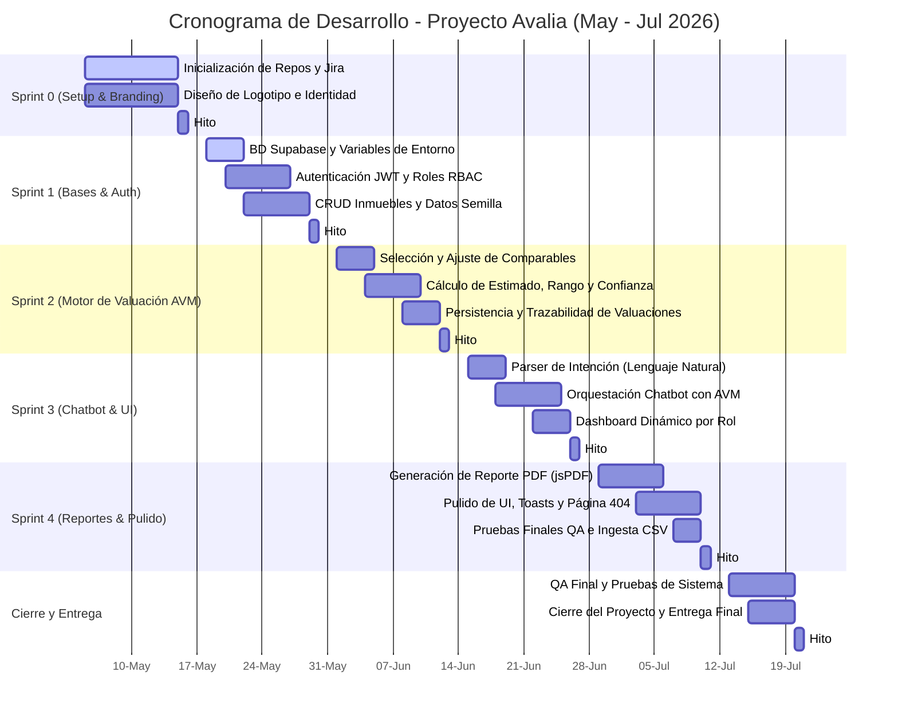

# Práctica 1.3: Diagrama de Gantt y Monitoreo del Tablero Kanban en Jira
**Proyecto:** Avalia (Sistema de Valuación Automatizada de Inmuebles)  
**Responsable:** Antonio Noriega Esteban (desempeñando roles de PO, SM y Dev Team)  
**Fecha:** Junio de 2026  

---

## 1. Cronograma del Proyecto: Diagrama de Gantt (Mermaid)

Este cronograma detalla la planificación temporal de los sprints del proyecto (sprints de 2 semanas) definidos por el **Product Owner** para abarcar desde el inicio el **05/05/2026** hasta el cierre el **20/07/2026**. Se incluye el código de Mermaid para visualizar el diagrama de Gantt directamente:

---

## 2. Monitoreo del Tablero Kanban (Scrum Master)
El **Scrum Master** se encarga de monitorear diariamente la transición de estados de las tareas en el tablero Kanban en Jira. Para el **Sprint 1**, el flujo y monitoreo de los issues se estructuró de la siguiente forma:

*   **Por Hacer (To Do):** Lista inicial de tareas priorizadas del Sprint Planning.
*   **En Progreso (In Progress):** Tareas en desarrollo activo.
*   **Revisión / QA (Code Review):** Tareas terminadas que requieren revisión cruzada de código y pruebas locales antes de fusionarse.
*   **Listo (Done):** Tareas que cumplen con la Definición de Listo (Definition of Done - DoD), probadas y con cambios mezclados en la rama principal (`master`).

### Estado del Kanban a mitad del Sprint 1 (Miércoles 20/05/2026)
*   **DONE:**
    *   `TASK-2.2.1` Configurar middleware de autenticación JWT.
    *   `TASK-2.1.1` [Backend] Esquema SQL de `usuarios` y tipo ENUM de roles.
*   **IN PROGRESS:**
    *   `TASK-2.2.2` Endpoint `POST /api/auth/login` (encriptación con bcrypt).
    *   `TASK-2.1.3` Implementar middleware de roles (RBAC).
*   **TO DO:**
    *   `TASK-2.1.4` [Frontend] Interfaz de administración de usuarios.
    *   `TASK-3.1.1` Diseñar esquemas de base de datos para `inmuebles`.
    *   `TASK-3.1.2` Crear endpoints de inmuebles (`GET/POST /api/inmuebles`).

---

## 3. Evidencias y Tareas Asignadas del Development Team
El **Development Team** describe con evidencias el avance del trabajo técnico en cada una de las tareas asignadas para el Sprint 1:

### Evidencia 1: Creación de la Base de Datos (Supabase)
Se ejecutó el script `backend/src/config/schema.sql` directamente en el editor SQL de Supabase. Esto generó las relaciones, las tablas de usuarios e inmuebles y los ENUMs necesarios.
*   **Evidencia de Verificación:** Conexión exitosa al cliente de base de datos y validación de las tablas creadas (`usuarios`, `inmuebles`, `zonas`).

### Evidencia 2: Implementación de la Capa de Autenticación
Desarrollo de los archivos de middleware. El token JWT se almacena de forma segura del lado del cliente.
*   **Código Validado:**
    *   En `backend/src/middleware/auth.js` se verifica la firma del token contra `JWT_SECRET`.
    *   En `backend/src/middleware/rbac.js` se restringe el acceso validando si el rol del usuario pertenece a los autorizados (`admin`, `valuador`, etc.).

### Evidencia 3: Ejecución de Flujo de Trabajo en Git
*   Creación de la rama `feature/HU-1.1-gestion-usuarios` para el desarrollo de la administración de accesos.
*   Creación de la rama `feature/HU-2.1-registrar-inmueble` para el desarrollo del registro del inmueble.
*   Solicitud de autorización al Scrum Master para fusionar ramas con `git merge --no-ff` a la rama `master`.
*   Mantener el control de versiones en orden y limpio para la revisión de fin de sprint.
