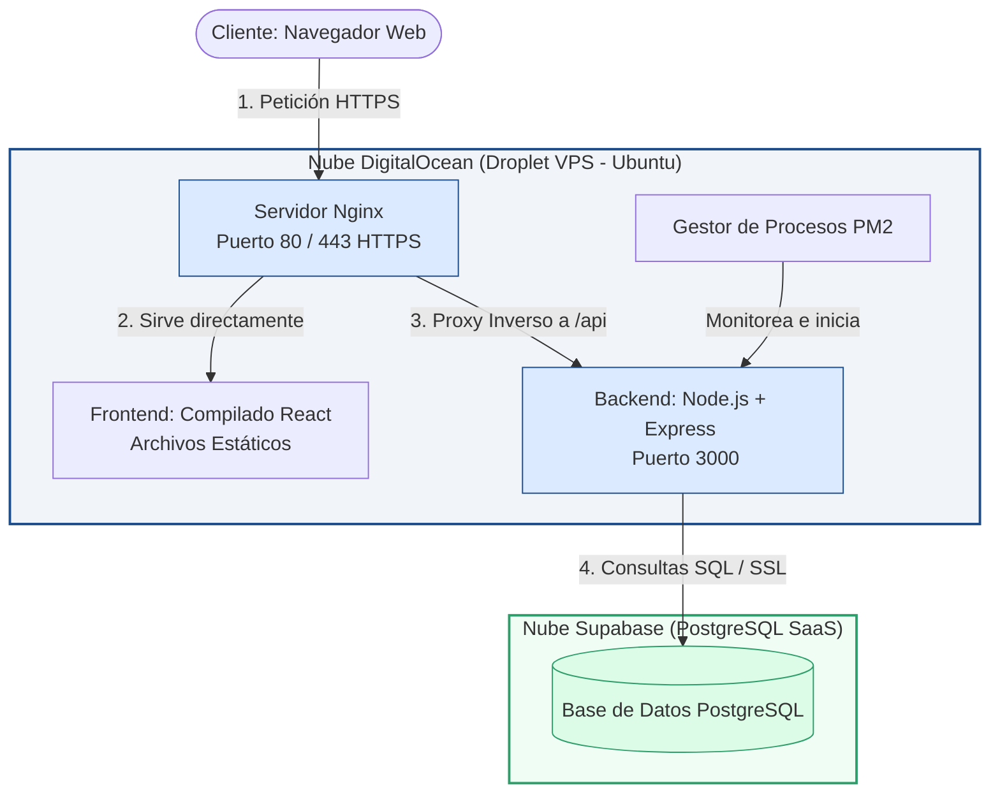

# Práctica 2.3: Elección de Servicios de Infraestructura en la Nube
**Proyecto:** Avalia (Sistema de Valuación Automatizada de Inmuebles)  
**Responsable:** Antonio Noriega Esteban (desempeñando roles de PO, SM y Dev Team)  
**Fecha:** Junio de 2026  

---

## 1. Objetivo
Identificar y realizar una investigación exhaustiva de las diferentes opciones de infraestructura para cómputo en la nube (IaaS/PaaS) disponibles en el mercado, evaluar sus características técnicas, ventajas, desventajas y modelos de costos, y seleccionar la opción óptima para el despliegue del sistema web de **Avalia** en base a criterios técnicos.

---

## 2. Introducción
El cómputo en la nube es la base sobre la que se operan los servicios web modernos. Para el proyecto **Avalia**, que consta de un backend de Node.js/Express (con el motor AVM y el chatbot) y un frontend en React, se requiere un entorno de ejecución persistente, seguro y económicamente viable. 

La base de datos relacional PostgreSQL ya corre en Supabase como un servicio administrado (SaaS). Por lo tanto, el foco de esta investigación se centra en la elección de la infraestructura de cómputo (servidor de aplicaciones) que interactúe con el cliente y despache las peticiones lógicas del backend.

---

## 3. Investigación Detallada de Proveedores de Cómputo en la Nube

A continuación, se presenta la investigación individual de cada uno de los proveedores indicados en la rúbrica de la práctica, detallando sus características y su viabilidad para albergar el stack Node/React:

### 3.1 Amazon Web Services (AWS) — Amazon EC2 (Elastic Compute Cloud)
*   **Definición y Concepto:** Es el servicio pionero de infraestructura como servicio (IaaS) que proporciona capacidad informática segura y de tamaño modificable mediante instancias de máquinas virtuales en la nube.
*   **Características Técnicas:**
    *   *Tipos de Instancias:* Amplia variedad categorizada en propósito general (e.g., T3, M5), optimizadas para cómputo (C5), optimizadas para memoria (R5) y aceleradas con GPUs.
    *   *Almacenamiento:* Integración nativa con volúmenes virtuales de bloque persistente (Amazon EBS) y almacenamiento de archivos compartidos (Amazon EFS).
    *   *Seguridad:* Redes aisladas mediante VPC (Virtual Private Cloud) y políticas de cortafuegos virtuales a nivel de instancia mediante Security Groups.
*   **Modelo de Costos:** Facturación por segundo de uso. Ofrece esquemas On-Demand (pago directo sin compromisos), Instancias Reservadas (descuentos de hasta 72% a cambio de contratos de 1 a 3 años) y Spot Instances (uso de capacidad ociosa con hasta 90% de descuento pero con riesgo de interrupción).
*   **Ventajas:** Es el estándar de la industria con la red global más robusta, disponibilidad en múltiples regiones y un catálogo gigantesco de servicios complementarios integrados.
*   **Desventajas:** Facturación extremadamente compleja; existen cobros adicionales poco visibles como la transferencia de datos de salida (data egress). La consola de administración es abrumadora para proyectos individuales o de nivel académico.

---

### 3.2 Microsoft Azure — Azure Virtual Machines
*   **Definición y Concepto:** Servicio de máquinas virtuales elásticas a demanda proporcionado por Microsoft, diseñado para ejecutar cargas de trabajo de sistemas basados tanto en Windows Server como en Linux.
*   **Características Técnicas:**
    *   *Tipos de Instancias:* Familias dedicadas como la serie B (ráfagas de uso general, económicas e ideales para web de tráfico moderado), la serie D (uso general estable) y la serie F (optimización de procesamiento aritmético).
    *   *Almacenamiento:* Azure Managed Disks con opciones de almacenamiento HDD estándar, SSD estándar, SSD Premium y discos Ultra para bases de datos de alto rendimiento.
    *   *Integraciones:* Sincronización nativa con Azure Active Directory para el control de acceso y Azure Key Vault para la protección de llaves criptográficas.
*   **Modelo de Costos:** Facturación por minuto. Azure destaca por la modalidad "Azure Hybrid Benefit", que permite reutilizar licencias físicas existentes de Windows Server y SQL Server para obtener descuentos.
*   **Ventajas:** Es el líder indiscutible para ambientes corporativos tradicionales. Posee una integración perfecta con tecnologías de Microsoft como .NET Core, SQL Server y Active Directory.
*   **Desventajas:** La consola web (Azure Portal) es pesada y de navegación compleja. Su ecosistema resulta redundante e ineficiente para proyectos que corren puramente sobre stacks de código abierto como Node.js y React.

---

### 3.3 Google Cloud Platform (GCP) — Compute Engine
*   **Definición y Concepto:** Infraestructura como servicio de Google que permite crear y ejecutar máquinas virtuales (VMs) directamente en la infraestructura global y de alta velocidad propiedad de Google.
*   **Características Técnicas:**
    *   *Tipos de Instancias:* Permite definir máquinas virtuales personalizadas (Custom Machine Types), donde el desarrollador elige la cantidad exacta de núcleos de CPU y memoria RAM. También cuenta con familias estándar como E2 (bajo costo) y N2 (propósito general).
    *   *Redes:* Utilización de la red de fibra óptica privada de Google, con balanceadores de carga de alta disponibilidad globales con IP única.
    *   *Almacenamiento:* Persistent Disks (SSD, HDD y SSD balanceado) con capacidad de redundancia multirregional.
*   **Modelo de Costos:** Pago por segundo. Destaca por aplicar automáticamente "Sustained Use Discounts" (descuentos automáticos si la instancia corre durante la mayor parte del mes sin contratos previos) y Spot VMs a bajo costo.
*   **Ventajas:** Flexibilidad inigualable de personalización de hardware, velocidad de arranque de las instancias en pocos segundos y excelente sintonía con arquitecturas de contenedores y Kubernetes (GKE).
*   **Desventajas:** El soporte técnico avanzado de nivel empresarial tiene un costo elevado y los precios de red por transferencia externa de datos suelen ser altos si no se configuran CDNs.

---

### 3.4 IBM Cloud — Virtual Servers
*   **Definición y Concepto:** Servidores virtuales en la nube pública y dedicada de IBM, orientados a satisfacer cargas de trabajo que requieren extrema seguridad física y lógica en ambientes altamente regulados.
*   **Características Técnicas:**
    *   *Opciones de Aislamiento:* Servidores públicos compartidos, servidores dedicados de inquilino único (Single Tenant) y servidores Bare Metal (computadoras físicas dedicadas sin hipervisor).
    *   *Cumplimiento:* Cumple de forma nativa con regulaciones gubernamentales y financieras estrictas como HIPAA (salud en EEUU), PCI-DSS (banca) y estándares militares de encriptación.
    *   *Almacenamiento:* Block Storage y File Storage (NFS) altamente redundante.
*   **Modelo de Costos:** Facturación por hora o planes mensuales fijos para recursos dedicados.
*   **Ventajas:** Es la opción idónea para sectores financieros, bancarios y de salud gubernamental que exigen hardware físico dedicado y certificaciones estrictas.
*   **Desventajas:** Los precios son sumamente elevados para startups o desarrollo universitario. Su interfaz es rígida y el catálogo enfocado a desarrollo ágil e independiente es limitado.

---

### 3.5 Oracle Cloud Infrastructure (OCI) — OCI Compute
*   **Definición y Concepto:** Servicio de cómputo elástico de Oracle diseñado sobre una arquitectura de nube de segunda generación, ofreciendo servidores físicos dedicados y máquinas virtuales flexibles.
*   **Características Técnicas:**
    *   *Capa Gratuita (Always Free Tier):* Ofrece hasta 4 vCPUs y 24 GB de memoria RAM basados en la arquitectura ARM de Ampere de forma gratuita y perpetua. Es actualmente el plan gratuito más potente de la industria.
    *   *Formas Flexibles:* Capacidad de ajustar los recursos en tiempo real sin reiniciar la instancia virtual.
*   **Modelo de Costos:** Costo de cómputo por hora altamente competitivo y tarifas de transferencia de datos de red significativamente más baratas que las de los tres gigantes (AWS, Azure y GCP).
*   **Ventajas:** Excelente relación costo-rendimiento, capa gratuita ideal para investigación y estudiantes, y sintonía perfecta con bases de datos de alto volumen de Oracle.
*   **Desventajas:** La consola tiene una curva de aprendizaje confusa debido a la nomenclatura de compartimentos y la interfaz para administrar redes virtuales (VCN) es compleja.

---

### 3.6 DigitalOcean — Droplets
*   **Definición y Concepto:** Máquinas virtuales basadas en Linux de aprovisionamiento rápido diseñadas con un enfoque absoluto en la simplicidad y la experiencia del desarrollador (Developer Experience - DX).
*   **Características Técnicas:**
    *   *Droplets Básicos:* Instancias con procesadores compartidos y discos SSD incorporados que inician con configuraciones mínimas (e.g., 512MB RAM / 1 vCPU).
    *   *Marketplace de un Clic:* Repositorio de plantillas listas que autoinstalan sistemas preconfigurados como Node.js, Docker, Lamp stack, WordPress, Django, etc.
    *   *Almacenamiento:* Bloques de almacenamiento (Volumes) ajustables y almacenamiento de objetos compatible con AWS S3 (Spaces).
*   **Modelo de Costos:** **Esquema de precios planos mensuales fijos.** Incluye una cuota amplia de transferencia de datos en el precio base.
*   **Ventajas:** Simplicidad inigualable de administración, precios transparentes sin cobros sorpresa a fin de mes, y una de las comunidades de tutoriales técnicos más grandes y detalladas de la web.
*   **Desventajas:** Carece de servicios sofisticados de infraestructura administrada empresarial, tales como almacenes de datos analíticos masivos (Data Warehouses) o herramientas de orquestación de IA nativas.

---

### 3.7 Alibaba Cloud — Elastic Compute Service (ECS)
*   **Definición y Concepto:** El proveedor de computación virtual líder del continente asiático, diseñado para ofrecer escalabilidad y velocidad de red con optimización geográfica en dicha región.
*   **Características Técnicas:**
    *   *Enrutamiento Express Connect:* Enlaces dedicados que omiten la red pública de Internet para conectar servidores locales con la nube en China.
    *   *Seguridad Integrada:* Protección contra ataques de denegación de servicio (DDoS) integrada directamente en la red de ECS.
*   **Modelo de Costos:** Ofrece modelos de suscripción mensual prepagada (que abaratan el costo ante proyectos de largo plazo) y pago por uso tradicional.
*   **Ventajas:** Es indispensable para desplegar aplicaciones dirigidas al mercado en China, facilitando enormemente el trámite gubernamental de la licencia ICP para operar sitios web en el país.
*   **Desventajas:** La consola de administración y la documentación están traducidas de forma inconsistente en español, y posee poca popularidad e integraciones en el mercado de desarrollo de software occidental.

---

### 3.8 Otro Proveedor (PaaS) — Render / Railway (Platform as a Service)
*   **Definición y Concepto:** Representan la evolución de la infraestructura (PaaS) donde el desarrollador no interactúa con servidores virtuales, consolas SSH o firewalls, sino que despliega su código directamente desde su repositorio de Git.
*   **Características Técnicas:**
    *   *Git-based Deployment:* Integración nativa con GitHub. Al hacer `git push master`, la plataforma compila, construye el contenedor (Docker) e inicia el servidor de manera automática.
    *   *SSL Automático:* Creación, renovación e instalación automática de certificados HTTPS sin intervención manual.
    *   *Mapeo de Rutas:* Manejo de proxies inverso internos automáticos.
*   **Modelo de Costos:** Planes mensuales planos fijos de bajo costo para desarrollo y escalado según memoria y tiempo de CPU por segundo en producción.
*   **Ventajas:** Cero mantenimiento de servidores. No requiere configurar Nginx, actualizaciones de seguridad de sistema operativo o Certbot, lo que acelera enormemente el lanzamiento de prototipos.
*   **Desventajas:** El costo por gigabyte de RAM y CPU es significativamente mayor que en una máquina virtual IaaS tradicional (como un Droplet) a medida que el tráfico del sistema crece.

---

## 4. Elección y Justificación: DigitalOcean Droplets

Para el despliegue de **Avalia**, la opción elegida es **DigitalOcean Droplets** (instancia de **1 vCPU, 1 GB RAM, 25 GB SSD, $6 USD/mes**).

### Justificación Técnica:
1.  **Independencia de la Base de Datos:** Dado que Supabase (SaaS) se encarga de la gestión, optimización y escalabilidad de la base de datos PostgreSQL de forma independiente, el Droplet solo se usará para el cómputo lógico (Express) y la entrega de archivos estáticos (React compilado). Por lo tanto, 1 GB de RAM es sumamente eficiente y suficiente.
2.  **Predecibilidad Económica:** En el ámbito académico e individual de este proyecto, contar con un precio fijo mensual plano evita facturas sorpresivas asociadas al ancho de banda consumido por peticiones al backend o cargas de archivos.
3.  **Control de Configuración (IaaS):** Permite al equipo configurar Nginx de forma personalizada para optimizar el proxy inverso de las rutas `/api` al backend, simular entornos reales de producción e interactuar con el sistema operativo mediante terminal SSH, lo que incrementa el aprendizaje práctico en administración de servidores.

---

## 5. Diagrama de Arquitectura de Despliegue (Mermaid)

El siguiente diagrama detalla la arquitectura física del sistema implementada sobre la infraestructura de nube elegida:



---

## 6. Plan de Despliegue Técnico (Paso a Paso)

El flujo de trabajo técnico estructurado por el **Development Team** para realizar el despliegue del sistema en el Droplet es el siguiente:

### Paso 1: Aprovisionamiento y Acceso SSH
Crear el Droplet de Ubuntu 24.04 LTS en el panel de DigitalOcean, asociar la llave SSH pública del administrador y acceder vía terminal:
```bash
ssh root@<IP_DEL_DROPLET>
```

### Paso 2: Configuración del Firewall (UFW)
Asegurar el servidor cerrando todos los puertos excepto los necesarios para la administración web:
```bash
ufw default deny incoming
ufw default allow outgoing
ufw allow 22/tcp     # SSH
ufw allow 80/tcp     # HTTP estándar
ufw allow 443/tcp    # HTTPS seguro
ufw --force enable
```

### Paso 3: Instalación de Node.js, Git y Nginx
Actualizar los repositorios de paquetes de Ubuntu e instalar las dependencias básicas:
```bash
sudo apt update && sudo apt upgrade -y
sudo apt install git nginx -y

# Instalar Node.js LTS mediante NodeSource
curl -fsSL https://deb.nodesource.com/setup_20.x | sudo -E bash -
sudo apt install -y nodejs
```

### Paso 4: Clonación y Configuración de Variables de Entorno
Clonar el repositorio del proyecto en `/var/www/avalia`, instalar las dependencias de producción y configurar las variables de entorno del backend:
```bash
cd /var/www
git clone https://github.com/AntonioNoriega/avalia.git
cd avalia/backend
npm install --omit=dev

# Crear archivo de variables de entorno
nano .env
```
*Dentro de `.env` se configuran las variables de acceso a Supabase y seguridad:*
```env
PORT=3000
SUPABASE_URL=https://xxxxx.supabase.co
SUPABASE_SERVICE_ROLE_KEY=eyJhbGciOi...
JWT_SECRET=super_secreto_avalia_2026
```

### Paso 5: Ejecución del Backend con PM2
Instalar el gestor de procesos **PM2** de forma global para asegurar que la API de Express se ejecute permanentemente en segundo plano y se reinicie automáticamente si ocurre un error fatal o si el servidor físico de DigitalOcean se reinicia:
```bash
sudo npm install -g pm2
cd /var/www/avalia/backend
pm2 start src/index.js --name "avalia-backend"
pm2 save
pm2 startup
```

### Paso 6: Compilación del Frontend (React + Vite)
Compilar los assets estáticos del lado del cliente en archivos HTML/JS optimizados:
```bash
cd /var/www/avalia/frontend
npm install
npm run build   # Esto genera la carpeta /var/www/avalia/frontend/dist
```

### Paso 7: Configuración de Nginx como Servidor Web y Proxy Inverso
Crear un archivo de configuración para Nginx en `/etc/nginx/sites-available/avalia` para redirigir las peticiones correspondientes:
```nginx
server {
    listen 80;
    server_name avalia.noriega.dev; # Dominio asignado

    # Ruta a los archivos estáticos del frontend React
    root /var/www/avalia/frontend/dist;
    index index.html;

    location / {
        try_files $uri $uri/ /index.html;
    }

    # Redirección de la API al puerto local del backend Express
    location /api/ {
        proxy_pass http://localhost:3000;
        proxy_http_version 1.1;
        proxy_set_header Upgrade $http_upgrade;
        proxy_set_header Connection 'upgrade';
        proxy_set_header Host $host;
        proxy_cache_bypass $http_upgrade;
    }
}
```
Activar el sitio y reiniciar Nginx:
```bash
ln -s /etc/nginx/sites-available/avalia /etc/nginx/sites-enabled/
rm /etc/nginx/sites-enabled/default
nginx -t
systemctl restart nginx
```

### Paso 8: Encriptación y SSL con Let's Encrypt
Instalar **Certbot** para obtener e instalar automáticamente un certificado SSL gratuito, forzando la redirección de todo el tráfico HTTP estándar a HTTPS seguro:
```bash
sudo apt install certbot python3-certbot-nginx -y
sudo certbot --nginx -d avalia.noriega.dev
```

---

## 7. Conclusiones
La investigación y análisis detallado de los proveedores de cómputo en la nube permiten estructurar un criterio técnico y maduro para la toma de decisiones de infraestructura. Mientras que los proveedores tradicionales como AWS, GCP y Azure ofrecen servicios altamente escalables y robustos para corporaciones globales, alternativas enfocadas en la experiencia del desarrollador como **DigitalOcean** son la opción ideal para proyectos ágiles, controlando el presupuesto mensual y simplificando el aprovisionamiento.
