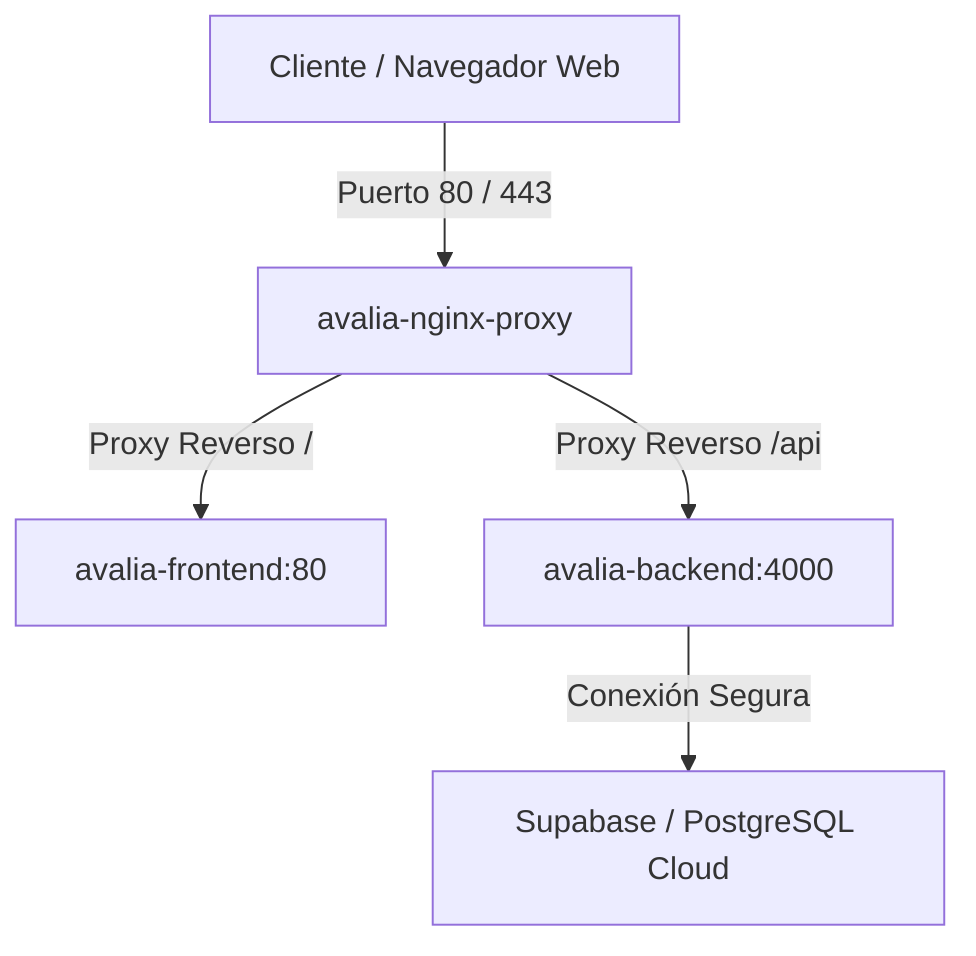

# Práctica 3.1: Despliegue y Ejecución de Contenedores Docker

Este documento detalla la arquitectura de contenedores, la configuración de orquestación y el plan de despliegue en producción de **Avalia — Sistema de Valuación Automatizada de Inmuebles**.

---

## 1. Arquitectura de Contenedores

Para garantizar un entorno reproducible, escalable y aislado, la aplicación ha sido dividida en tres contenedores de servicios especializados:



### Servicios Orquestados
1. **Frontend (`avalia-frontend`)**: Contiene la SPA construida con React + Vite + TailwindCSS. Servida mediante un servidor web Nginx embebido y ligero.
2. **Backend (`avalia-backend`)**: API REST construida en Node.js + Express que implementa el motor de valuación y orquesta el flujo de negocio.
3. **Nginx Proxy (`avalia-nginx-proxy`)**: Actúa como proxy reverso frontal y terminador SSL (HTTPS), distribuyendo el tráfico web de forma segura.

---

## 2. Imágenes de Docker Optimizadas

Hemos diseñado Dockerfiles independientes y optimizados utilizando el principio de **construcción multi-etapa (multi-stage build)** para reducir el tamaño final de la imagen y evitar fugas de credenciales de desarrollo.

### 2.1. Dockerfile del Backend (`backend/Dockerfile`)
[Ver Dockerfile del Backend](file:///c:/Users/anton/OneDrive/Desktop/antonio/backend/Dockerfile)

*   **Optimización clave**: Se utiliza la imagen base `node:20-alpine` que pesa menos de 40MB. En la primera etapa (`builder`) se compilan e instalan los módulos de desarrollo (`npm ci`), y en la segunda etapa solo se copian los archivos necesarios para la ejecución del servidor Express, descartando las herramientas de compilación pesadas y reduciendo la superficie de ataque.

### 2.2. Dockerfile del Frontend (`frontend/Dockerfile`)
[Ver Dockerfile del Frontend](file:///c:/Users/anton/OneDrive/Desktop/antonio/frontend/Dockerfile)

*   **Optimización clave**: También implementa multi-stage build. La primera etapa compila el código fuente en JavaScript optimizado y minificado (`dist/`). La segunda etapa utiliza una imagen oficial de `nginx:alpine`, copia únicamente el directorio compilado (`dist/`) al directorio raíz de Nginx (`/usr/share/nginx/html`) y descarta todo el entorno de Node.js, logrando una imagen final sumamente rápida y de apenas unos megabytes.

---

## 3. Orquestación con Docker Compose

Utilizamos `docker-compose` para definir, orquestar y relacionar las redes y volúmenes de los servicios en un comando unificado.

[Ver docker-compose.yml](file:///c:/Users/anton/OneDrive/Desktop/antonio/docker-compose.yml)

### Aspectos relevantes de la orquestación:
*   **Red de Contenedores (`avalia-network`)**: Se define una red interna tipo `bridge` para permitir que los servicios backend y frontend se comuniquen usando nombres DNS de Docker (por ejemplo, `http://backend:4000`), bloqueando el acceso externo directo al backend.
*   **Variables de Entorno**: Se utiliza la instrucción `env_file` en el backend para inyectar de forma segura las variables confidenciales (`SUPABASE_URL`, `SUPABASE_SERVICE_ROLE_KEY` y `JWT_SECRET`) desde un archivo `.env` local que **no** se sube al repositorio de Git.
*   **Volúmenes**: Nginx frontal monta el archivo de configuración `nginx.conf` en modo de solo lectura (`ro`) y comparte volúmenes montados con Let's Encrypt/Certbot para almacenar y renovar certificados SSL persistentes.

---

## 4. Configuración de Nginx + HTTPS

El proxy reverso unifica el frontend y la API bajo el mismo puerto y nombre de dominio, lo que elimina problemas de CORS en los navegadores y proporciona cifrado de datos mediante HTTPS.

[Ver nginx.conf](file:///c:/Users/anton/OneDrive/Desktop/antonio/nginx.conf)

### Flujo de peticiones en Nginx:
*   Las rutas bajo `/api/` son redirigidas al backend (`http://backend:4000/api/`).
*   El resto de peticiones `/` son enviadas al frontend de React (`http://frontend:80`).
*   Se habilita la compresión **Gzip** para archivos HTML, CSS y JS, reduciendo el ancho de banda y mejorando los tiempos de respuesta.
*   Se define la ruta especial `/.well-known/acme-challenge/` para permitir que el agente de Certbot valide la propiedad del dominio y expida certificados SSL automáticamente.

---

## 5. Guía de Despliegue en VPS (AWS, Azure, GCP o DigitalOcean)

Sigue estos pasos para desplegar el entorno de producción en un servidor en la nube (ej. Debian/Ubuntu):

### Paso 1: Configurar el Servidor VPS
Instalar Docker y Docker Compose en la máquina virtual:
```bash
sudo apt update && sudo apt upgrade -y
sudo apt install -y docker.io docker-compose git
sudo systemctl enable --now docker
```

### Paso 2: Clonar el Repositorio y Configurar Entorno
1. Clonar el código del proyecto:
   ```bash
   git clone https://github.com/AntonioNoriega/avalia.git /var/www/avalia
   cd /var/www/avalia
   ```
2. Crear el archivo de configuración `.env` en la carpeta `backend/`:
   ```bash
   nano backend/.env
   ```
   *Pegar la configuración con los valores de producción:*
   ```env
   PORT=4000
   JWT_SECRET=tu_secreto_super_seguro_produccion
   SUPABASE_URL=https://tu-proyecto.supabase.co
   SUPABASE_SERVICE_ROLE_KEY=tu_service_role_key
   ```

### Paso 3: Inicializar y Obtener Certificados SSL (HTTPS)
1. Levantar los contenedores en HTTP (puerto 80) para permitir la validación del dominio:
   ```bash
   sudo docker-compose up -d
   ```
2. Solicitar el certificado SSL gratuito de Let's Encrypt (reemplazando `tu-dominio.com` y su respectivo correo):
   ```bash
   sudo docker run --rm -it \
     -v "/var/www/avalia/certbot/conf:/etc/letsencrypt" \
     -v "/var/www/avalia/certbot/www:/var/www/certbot" \
     certbot/certbot certonly --webroot \
     -w /var/www/certbot -d tu-dominio.com --email tu-correo@correo.com --agree-tos --no-eff-email
   ```
3. Editar `nginx.conf` en el servidor para descomentar las directivas de redirección a HTTPS (301) y la configuración del puerto 443 con los archivos SSL generados.
4. Reiniciar Nginx para aplicar el cifrado:
   ```bash
   sudo docker-compose restart nginx
   ```

---

## 6. Monitoreo y Actualización de Contenedores

Una vez desplegada la aplicación, es fundamental establecer políticas de mantenimiento y supervisión continua:

### 6.1. Comando de Monitoreo Rápido
*   **Estado de Contenedores**: `sudo docker-compose ps`
*   **Consumo de Recursos (CPU/RAM)**: `sudo docker stats`
*   **Lectura de Logs**: `sudo docker-compose logs -f --tail=100 [nombre-del-servicio]`

### 6.2. Actualizaciones sin Caída de Servicio (Rolling Update)
Cuando se realicen cambios en el código y se suban a la rama `master`:
```bash
cd /var/www/avalia
git pull origin master
# Reconstruir imágenes y levantar servicios sin apagar los contenedores activos
sudo docker-compose up -d --build --no-deps frontend backend
```

### 6.3. Renovación Automática de Certificados SSL
Configurar una tarea programada (cronjob) para comprobar y renovar el certificado SSL cada mes:
```bash
sudo crontab -e
```
*Añadir la siguiente línea al final para que ejecute Let's Encrypt y recargue Nginx a las 3:00 AM el primer día de cada mes:*
```text
0 3 1 * * docker run --rm -v "/var/www/avalia/certbot/conf:/etc/letsencrypt" -v "/var/www/avalia/certbot/www:/var/www/certbot" certbot/certbot renew && docker-compose exec -T nginx nginx -s reload
```
